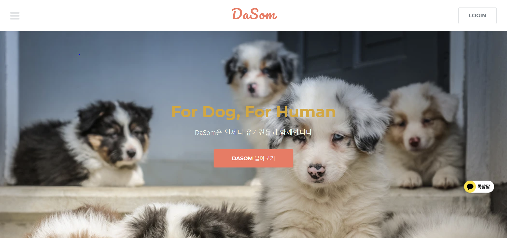
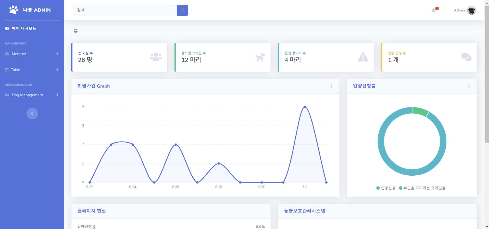

 

<h2> KH정보교육원 4팀 <다솜> :dog2:유기견 입양 플랫폼 웹페이지  프로젝트 </h2>

 
 

### <다솜>프로젝트

<ul>
  <li>유기견 입양 플랫폼 웹페이지 구현 프로젝트</li>
  <li>5인 팀프로젝트</li>
  <li>KH 정보교육원 세미프로젝트</li>
</ul> 
 
### 프로젝트 기간

2020.05.20~2020.07.02

### 프로젝트 개요

반려견의 수가 증가하는 만큼 유기견의 수도 증가하고 있다. 유기견은 공고일 기준 10일 이내 입양/귀가되지 않을 시 약 90%확률로 안락사되기 때문에 10일이내 입양/귀가하는 것이 중요하다.
유기견에 대한 입양을 원할하게 하기 위해서 공고일 기준 유기견을 상단노출 시키고 입양에 대한 사용자 편리성에 주안점을 둔 입양 플랫폼을 구현하는 것이 이번 프로젝트의 목적이다.

### 웹 어플리케이션 주요기능

1. 관리자 페이지 
<ul>
    <li>메인 :   웹사이트 각종 상태표시, 상태 Progress-bar, 회원가입 차트그래프, 입양률 파이그래프, 입양신청 header 알림벨 기능, 로그인 로그아웃</li>
    <li>등록 : 유기견 등록, 유기견 보호소 등록</li>
    <li>게시판관리 : QNA,분실견, 유기견 게시판 관리, 입양신청 처리</li>
    <li>회원관리 : 회원정보조회(기본정보, 유기견찜목록, 분양받은 유기견), 정보 업데이트(팝업)</li>
</ul>
2. 유저페이지 
<ul>
     <li>메인 : 화면에 따라오는 서브메뉴, 카카오톡 1:1채팅 배너</li>
     <li>회원 : 로그인, 로그아웃, 마이페이지(개인정보수정, 입양받은 유기견목록, 유기견 찜목록),</li>
     <li>가족찾기 : 유기견 좋아요(찜)기능, 입양신청, 무한스크롤, 스크롤 위치 Progress bar 상단표시</li>
     <li>각종 게시판 : 분실견 게시판과 QNA게시판</li>
     <li>보호소 찾기 : 카카오톡 지도 API를 활용한 유기견 보호소 위치 정보 검색 서비스와 보호중 유기견 조회</li>
</ul>

### 사용언어

JSP / SQL / JSTL / JAVA / AJAX / JQUERY / HTML/CSS / JAVASCRIPT

### WAS

Apache Tomcat9.0

### Pattern

MVC2방식

### DataBase

ORACLE 11g Express Edition Release 11.2.0

### Tool

Eclipse JEE-2020-03/ JDK 1.8 / CHROME / SQL DEVELOPER

### 프로젝트관리툴

Trello를 사용한 일정관리 
Trello 주소 : https://trello.com/b/DebnHrMf/kh%EC%B5%9C%EA%B0%95%EA%B0%95%EC%95%84%EC%A7%80-4%EC%A1%B0-%ED%94%84%EB%A1%9C%EC%A0%9D%ED%8A%B8%ED%8C%80

### 개발 이미지(완료)

더 많은 이미지 : https://github.com/choipureum/Abandoned_Dogs_Save_Project/tree/master/img
 

 <h4>사용자메인</h4>

 <h4>관리자 메인</h4>

